# CodeVortex — Application Execution Flow

> Every path from keystroke to output. Covers current implementation and target (roadmap) design so you can trace any scenario end-to-end.

**Participants legend**

| Shorthand | Service |
|---|---|
| `Browser` | React SPA (Monaco, xterm.js, Redux, File Explorer) |
| `API` | Express API Server (stateless monolith) |
| `Auth` | Auth Middleware + Auth Controller |
| `FileCtrl` | File Controller |
| `ExecCtrl` | Execution Controller |
| `ExecSvc` | Code Execution Service (`codeExecutionService.js` / future `dockerode`) |
| `TermSvc` | Terminal Service (`terminalService.js` + `node-pty`) |
| `Mongo` | MongoDB Atlas (`users`, `projects`, `files`, `execution_logs`) |
| `Redis` | Redis (`rate:*`, `process:*`, `terminal:*`, buffers) |
| `Docker` | Docker Engine (per-execution ephemeral containers) |
| `Gemini` | Google Gemini 2.5 Flash (vision + chat) |
| `SIO` | Socket.IO layer (same process as API, shown separately when it matters) |

All diagrams are **Mermaid `sequenceDiagram`** — vertical lifelines = services, horizontal arrows = calls/events. Copy any block into https://mermaid.live to render.

---

## 0. Master Overview — How Everything Connects

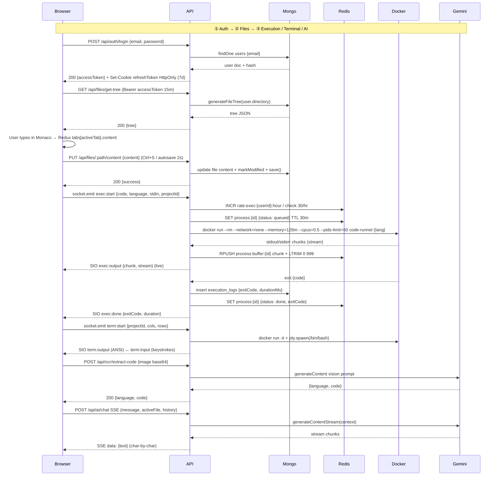

---

## 1. Bootstrap & Authentication

### 1.1 App Bootstrap (first paint → ready)

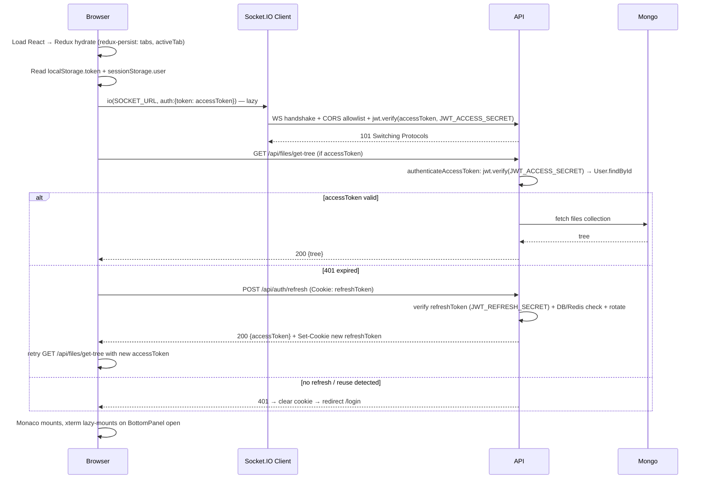

### 1.2 Register

```mermaid
sequenceDiagram
    participant Browser
    participant API
    participant Mongo
    participant Redis
    Browser->>API: POST /api/auth/register {username, email, password}
    API->>Mongo: findOne {email}
    alt email exists
        Mongo-->>API: doc found
        API-->>Browser: 400 {message: User already exists}
    else new user
        API->>API: bcrypt genSalt(10) + hash
        API->>Mongo: save User {username, email, passwordHash}
        API->>API: jti=uuid(); accessToken=sign({userId,email,jti}, JWT_ACCESS_SECRET, 15m); refreshToken=sign({userId,jti: refreshJti}, JWT_REFRESH_SECRET, 7d)
        API->>Mongo: save refresh_tokens {userId, jti: refreshJti, tokenHash: sha256(refreshToken), expiresAt}
        API->>Redis: SET refresh:{refreshJti} 1 EX 7d
        Mongo-->>API: created
        API-->>Browser: 201 {accessToken} + Set-Cookie refreshToken HttpOnly
        Browser->>Browser: accessToken in memory only; nav /ide
    end
```

### 1.3 Login (email/password)

```mermaid
sequenceDiagram
    participant Browser
    participant API
    participant Mongo
    participant Redis
    Browser->>API: POST /api/auth/login {email, password}
    API->>Mongo: findOne {email}
    alt not found
        API-->>Browser: 404 {message: User not found}
    else found
        API->>API: bcrypt.compare(password, hash)
        alt mismatch
            API-->>Browser: 400 {message: Invalid credentials}
        else match
            API->>API: jti=uuid(); accessToken 15m + refreshToken 7d (different secrets)
            API->>Mongo: create refresh_tokens {jti, tokenHash}
            API->>Redis: SET refresh:{jti} 1 EX 7d
            API-->>Browser: 200 {accessToken, name} + Set-Cookie refreshToken
            Browser->>Browser: store accessToken in memory, not localStorage
        end
    end
```

### 1.4 Google OAuth

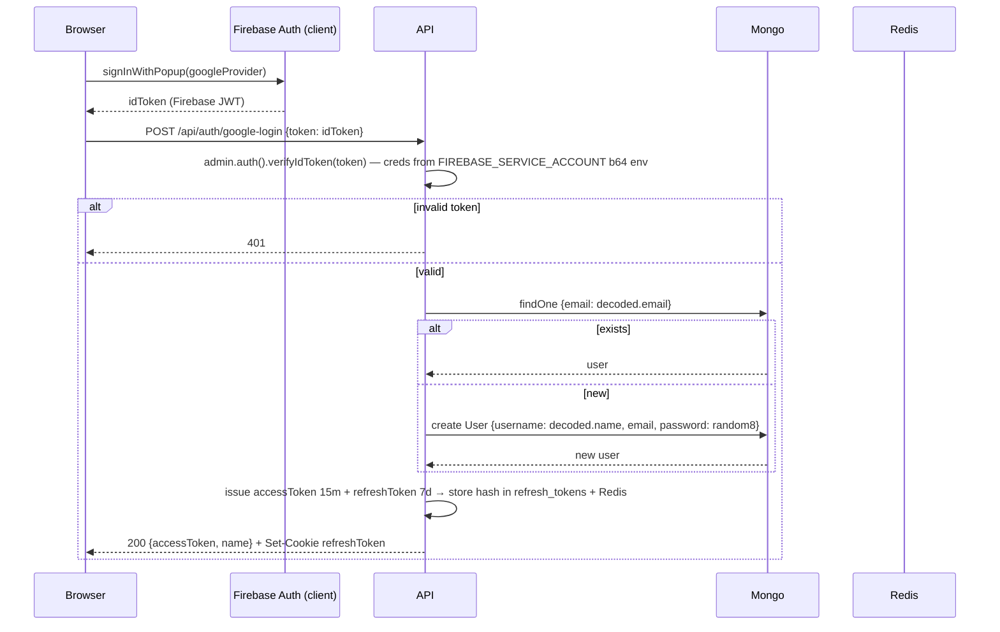

### 1.5 Auth on Protected Routes (Access Token)

```mermaid
sequenceDiagram
    participant Browser
    participant Auth as authenticateAccessToken
    participant Ctrl as Controller
    participant Mongo
    Browser->>Auth: Any /api/files/* or /api/execute/* + Authorization: Bearer <accessToken 15m>
    Auth->>Auth: jwt.verify(JWT_ACCESS_SECRET) + Redis revoked check
    alt missing / expired / bad sig
        Auth-->>Browser: 401 {error: Invalid or expired access token}
        Browser->>Browser: POST /api/auth/refresh (cookie) → new accessToken → retry
    else valid
        Auth->>Mongo: User.findById(decoded.userId)
        alt user not found
            Auth-->>Browser: 401
        else found
            Auth->>Ctrl: req.user = user; next()
            Ctrl->>Ctrl: ownership check (file.userId === req.user.id)
            alt forbidden
                Ctrl-->>Browser: 403
            else ok
                Ctrl-->>Browser: 200 (handler result)
            end
        end
    end
```

### 1.6 Refresh & Logout

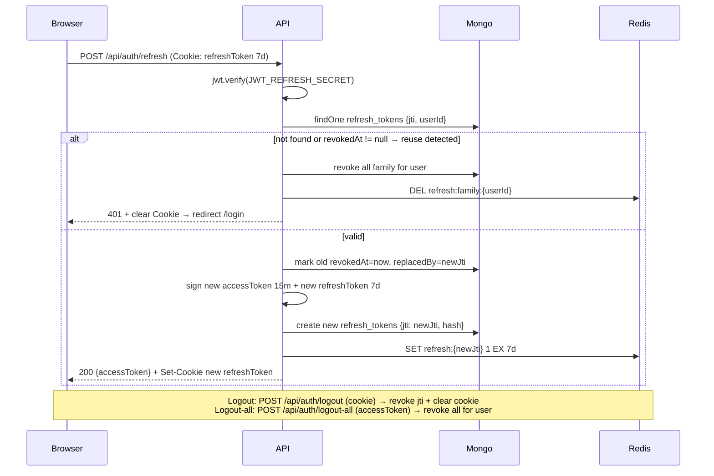

---

## 2. File System — Write → Save → Read

### 2.1 Open / Read File

```mermaid
sequenceDiagram
    participant Browser
    participant Redux as Redux Store
    participant API
    participant Mongo
    Browser->>Browser: Click file in FileTree (src/main.py)
    Browser->>Redux: dispatch(openFile) optimistic? no — fetch first
    Browser->>API: GET /api/files/src/main.py/content (Bearer JWT)
    API->>Mongo: walk user.directory items by path split "/" (current) / findOne files {projectId, path} (target)
    Mongo-->>API: {content}
    API-->>Browser: 200 {content}
    Browser->>Redux: dispatch(openFile {name, content, path})
    Browser->>Browser: sessionStorage.currentPath = path; Monaco language = getLanguageFromExtension(path)
```

### 2.2 Write (keystrokes in Monaco)

```mermaid
sequenceDiagram
    participant User
    participant Monaco as Monaco Editor
    participant Redux as Redux Store
    participant Browser
    User->>Monaco: Type / paste / autocomplete
    Monaco->>Browser: onChange(newCode)
    Browser->>Redux: dispatch(updateFileContent {path: activeTab, content: newCode})
    Browser->>Browser: setCode(newCode); setDirty(true) → tab shows ●
    Note over Browser: No API call yet — debounced
    Browser->>Browser: useDebouncedCallback 2000ms
    alt 2s idle (target) —Autosave—
        Browser->>API: PUT /api/files/:path/content {content: newCode}
        API->>Mongo: update + markModified + save()
        API-->>Browser: 200 {success}
        Browser->>Browser: setDirty(false); toast.success Saved
    else user presses Ctrl+S (current + target) —Manual Save—
        User->>Browser: Ctrl+S keydown
        Browser->>API: PUT /api/files/:path/content {content}
        API-->>Browser: 200
        Browser->>Browser: remove ●
    else user closes tab with dirty
        Browser->>API: PUT save before close
        Browser->>Redux: dispatch(closeTab)
    end
```

### 2.3 Create File / Folder

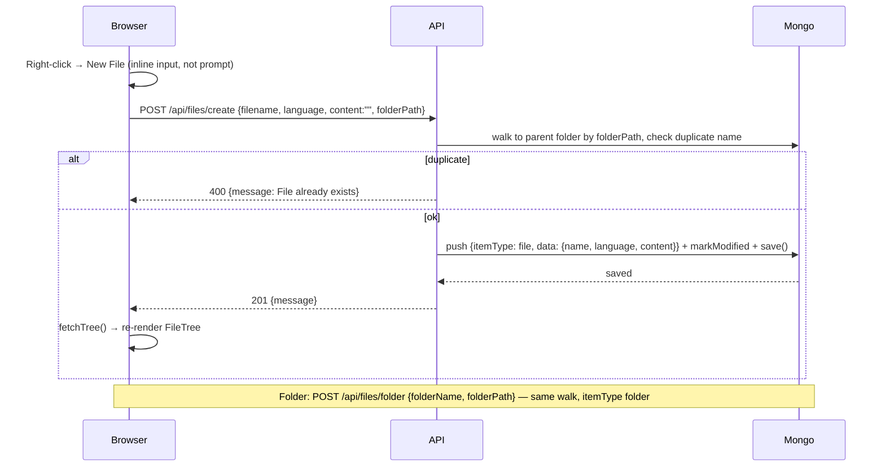

### 2.4 Delete / Rename

```mermaid
sequenceDiagram
    participant Browser
    participant API
    participant Mongo
    Browser->>API: DELETE /api/files/file/:path  (or /folder/:path)
    API->>Mongo: walk to parent, splice items[index], markModified, save()
    API-->>Browser: 200 {message}
    Browser->>Browser: Redux remove tab if open; fetchTree()
    Note over Browser,Mongo: Rename (target, missing today): PUT /api/files/:path/rename {newName} — validate !includes .. + regex, update path + name
```

### 2.5 List Tree

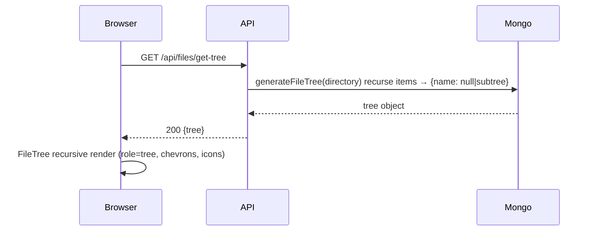

---

## 3. Code Execution — The Core Flow

### 3.1 Current Implementation (Sync, Insecure — What Ships Today)

```mermaid
sequenceDiagram
    participant Browser
    participant API
    participant ExecSvc as codeExecutionService
    participant Host as Host OS (no isolation)
    Browser->>Browser: handleRunButton(): inputVal.replace newline, filename=activeTab
    Browser->>API: POST /api/execute/run {language, code, input, filename} — NO auth header (bug)
    API->>ExecSvc: execCode(language, code, input, filename)
    alt language = javascript
        ExecSvc->>Host: spawn("node", ["-e", code])
    else python
        ExecSvc->>Host: spawn("python", ["-c", code])
    else java
        ExecSvc->>Host: write os.tmpdir()/filename → exec javac → spawn java -cp tmpDir ClassName
    else cpp
        ExecSvc->>Host: write tmpDir/file → exec g++ -o prog.exe → spawn prog.exe
    else c
        ExecSvc->>Host: write tmpDir/file → exec gcc -o prog.exe → spawn prog
    end
    ExecSvc->>Host: child.stdin.write(input); child.stdin.end() — pre-execution only
    Host-->>ExecSvc: stdout chunks → stdoutData +=
    Host-->>ExecSvc: stderr chunks → stderrData +=
    Host-->>ExecSvc: close(exitCode)
    ExecSvc->>ExecSvc: cleanup unlink(tmpFile, prog.exe/Main.class) — buggy: checks "c++" not "cpp"
    alt exitCode == 0
        ExecSvc-->>API: {stdout: stdoutData, stderr: stderrData, exit_code: 0, status:{id:0}}
    else non-zero
        ExecSvc-->>API: {stdout: stderrData, stderr: stderrData, exit_code: code} — BUG stdout/stderr swap
    end
    API-->>Browser: 200 JSON {stdout, stderr, ...}
    Browser->>Browser: setoutputVal(res.stdout else res.stderr) → <pre> render
    Note over ExecSvc,Host: No timeout, no cgroups, runs as server UID, can read env, fork-bomb, hang forever
```

### 3.2 Target Implementation (Docker + Streaming + Redis — Roadmap)

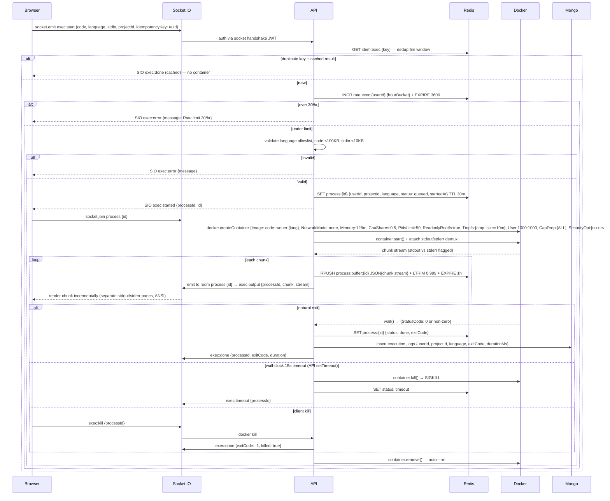

### 3.3 Compiled Languages — Detail (Java / C / C++)

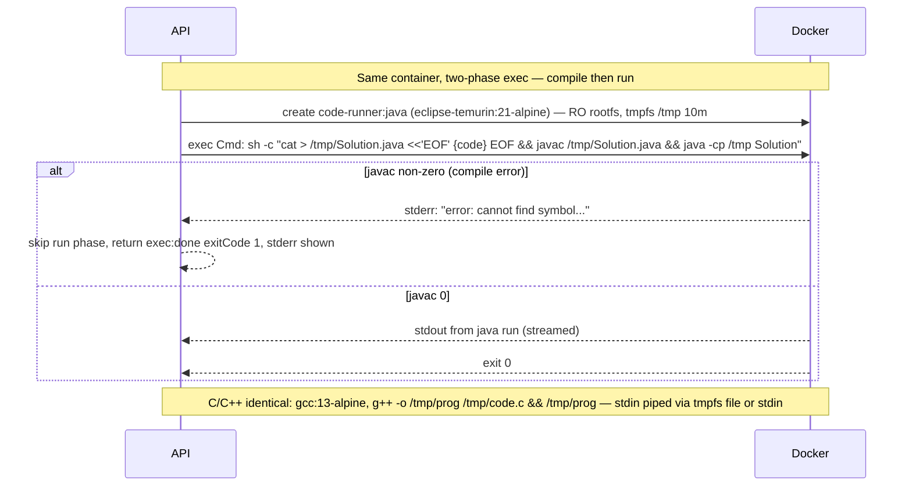

### 3.4 Stdin Scenarios

```mermaid
sequenceDiagram
    participant Browser
    participant SIO as Socket.IO
    participant API
    participant Docker

    Note over Browser,Docker: Case A — Pre-execution stdin (today + target phase 1): input textarea before Run
    Browser->>SIO: exec:start {code, stdin: "5\n10\n"}
    SIO->>API: write stdin once before spawn
    API->>Docker: container stdin.write("5\n10\n") then end()
    Docker-->>SIO: output uses that input, then exits

    Note over Browser,Docker: Case B — Mid-execution stdin (target phase 2): Python input() / scanf / readline
    Browser->>SIO: exec:start {code: "name=input('Name:'); print(f'Hi {name}')", language: python}
    SIO->>API: spawn, streaming
    Docker-->>SIO: exec:output {chunk: "Name: ", stream: stdout} — prompt shown, process blocks on read
    Browser->>Browser: Show inline stdin input (or terminal) — user types "Alice" + Enter
    Browser->>SIO: process:stdin {processId, data: "Alice\n"}
    SIO->>API: container stdin.write("Alice\n")
    API->>Docker: write to process stdin
    Docker-->>SIO: exec:output {chunk: "Hi Alice\n"}
    Docker-->>SIO: exec:done {exitCode:0}

    Note over Browser,Docker: Case C — No stdin, pure compute
    Browser->>SIO: exec:start {code: "print(sum(range(100)))"}
    SIO-->>Browser: exec:output → exec:done (no stdin round-trip)
```

### 3.5 All Execution Outcome Scenarios

```mermaid
sequenceDiagram
    participant Browser
    participant SIO as Socket.IO
    participant API
    participant Docker
    participant Redis
    participant Mongo

    Note over Browser,Mongo: ✅ Success (exit 0)
    Browser->>SIO: exec:start {code:"print('hi')"}
    Docker-->>SIO: chunk "hi\n" (stdout)
    Docker-->>SIO: exit 0
    SIO-->>Browser: exec:done {exitCode:0, duration: 42} + green status

    Note over Browser,Mongo: ❌ Runtime error (exit non-zero)
    Browser->>SIO: exec:start {code:"print(1/0)"}
    Docker-->>SIO: chunk 'ZeroDivisionError...' (stderr)
    Docker-->>SIO: exit 1
    SIO-->>Browser: exec:done {exitCode:1} → stderr pane red + "Explain this error" button

    Note over Browser,Mongo: ❌ Compile error (Java/C/C++)
    Browser->>SIO: exec:start {language:java, code:"public class X { syntax error }"}
    Docker-->>SIO: stderr "javac: error: ';' expected"
    Docker-->>SIO: exit 1 (no run phase)
    SIO-->>Browser: exec:done exit 1 — compile error UX

    Note over Browser,Mongo: ⏱ Timeout (15s wall-clock)
    Browser->>SIO: exec:start {code:"while True: pass"}
    Docker-->>SIO: (no output, CPU capped 0.5 via --cpus)
    API->>API: setTimeout 15000ms fires
    API->>Docker: kill(SIGKILL)
    API->>Redis: SET status timeout
    SIO-->>Browser: exec:timeout {processId} → toast Execution timed out after 15s

    Note over Browser,Mongo: 🛑 User killed
    Browser->>SIO: exec:start {code:"sleep 100"}
    Browser->>SIO: exec:kill {processId} (Kill button)
    SIO->>API: docker kill
    API->>SIO: exec:done {exitCode:-1, killed:true}

    Note over Browser,Mongo: 🚫 Rate limited
    Browser->>SIO: exec:start (31st in hour)
    API->>Redis: INCR → 31 > 30
    SIO-->>Browser: exec:error {message: Rate limit exceeded 30/hr}

    Note over Browser,Mongo: 🧨 Resource kill (OOM / fork bomb — kernel, not API)
    Browser->>SIO: exec:start {code:"x=[0]*10**9  or  fork bomb"}
    Docker-->>API: OOM killer / pids-limit 50 kills container → exit 137
    SIO-->>Browser: exec:done {exitCode:137, status:killed} — memory limit message

    Note over Browser,Mongo: 🔒 Auth / validation fail
    Browser->>SIO: exec:start {language:"brainfuck"} or code >100KB or no JWT
    SIO-->>Browser: exec:error {message: Unsupported language / Payload too large / Unauthorized}

    Note over Browser,Mongo: 🔁 Idempotent retry (same idempotencyKey within 5m)
    Browser->>SIO: exec:start {idempotencyKey: abc, ...} — double-click Run
    API->>Redis: GET idem:exec:abc → hit
    SIO-->>Browser: exec:done (cached result, no second container)
```

---

## 4. Interactive Terminal (xterm.js + node-pty + Docker)

### 4.1 Terminal Session Lifecycle

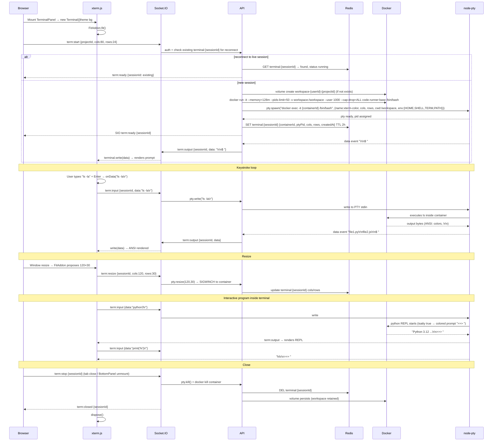

### 4.2 Why PTY Matters

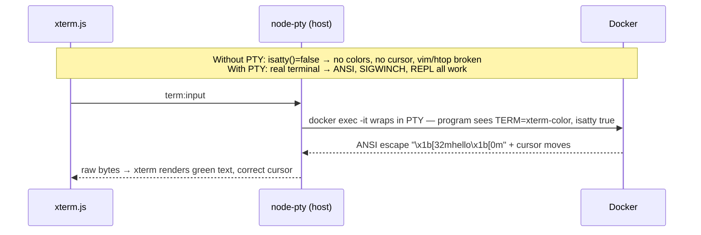

---

## 5. Image → Code (OCR via Gemini Vision)

```mermaid
sequenceDiagram
    participant Browser
    participant API
    participant Redis
    participant Gemini

    Browser->>Browser: Click Upload Image → <input type=file> → FileReader.readAsDataURL
    Browser->>Browser: Preview + validate client-side (image/*, <5MB)
    Browser->>API: POST /api/ocr/extract-code {image: base64, mimeType} — Bearer JWT
    API->>Redis: INCR rate:ocr:{userId}:{dayBucket} — limit 10/day
    alt over limit
        API-->>Browser: 429 {error: OCR limit 10/day}
    else under
        API->>API: validate ALLOWED_MIME {jpeg,png,webp,gif}, decodedBytes ≤5MB
        alt invalid
            API-->>Browser: 400 {error: Unsupported type / too large}
        else valid
            API->>Gemini: getGenerativeModel(gemini-2.5-flash).generateContent([{text: structured JSON prompt}, {inlineData:{mimeType, data}}])
            Note over API,Gemini: Prompt: return {language, code} JSON, preserve logic, fix OCR noise only
            Gemini-->>API: raw text (maybe ```json ... ```)
            API->>API: strip ```json fences → JSON.parse → {language, code} fallback raw text
            API-->>Browser: 200 {language, code}
            Browser->>Browser: CodeEditorPopup preview — language badge + editable code
            Browser->>Browser: User edits → Run → same exec flow as §3 (imageCode, Solution.java default — fixed in target)
        end
    end
```

---

## 6. AI Chat (Streaming SSE)

```mermaid
sequenceDiagram
    participant Browser
    participant API
    participant Redis
    participant Gemini

    Browser->>Browser: AIChatPanel: user types "Explain this error" → input + activeFile + executionOutput + history(10)
    Browser->>API: POST /api/ai/chat {message, activeFile:{name,language,content:0..8000}, executionOutput:{stderr:0..2000}, history: last 10 turns} — Bearer JWT
    API->>Redis: INCR rate:ai_chat:{userId}:{dayBucket} — 100/day; also 20/hr check
    alt rate exceeded
        API-->>Browser: 429 {error}
    else ok
        API->>API: buildChatContext(): system prompt + activeFile block + stderr block + history + user message
        API->>Browser: headers: Content-Type text/event-stream, Cache-Control no-cache, Connection keep-alive
        API->>Gemini: generateContentStream(context) — model gemini-2.5-flash
        loop each chunk
            Gemini-->>API: chunk.text()
            API-->>Browser: SSE "data: {\"text\": chunk}\n\n" → appendToChat incrementally
            Browser->>Browser: streaming render in bubble (markdown + code fences)
        end
        Gemini-->>API: stream end
        API-->>Browser: SSE "data: [DONE]\n\n" → setStreaming(false)
    end

    Note over Browser,Gemini: Quick actions — same endpoint, prebuilt prompts:<br/>"Explain this error" → activeFile + stderr<br/>"Explain selected code" → selectedText + language<br/>"Improve" → diff view via Monaco diff editor
```

---

## 7. Reconnection, Heartbeat & Crash Recovery

### 7.1 Buffered Replay on Reconnect

```mermaid
sequenceDiagram
    participant Browser
    participant SIO as Socket.IO
    participant API
    participant Redis

    Note over Browser,Redis: User refreshes / loses Wi-Fi mid-execution
    Browser->>SIO: reconnect + socket.emit exec:reconnect {processId}
    SIO->>API: handler
    API->>Redis: GET process:{processId}
    alt not found (TTL expired 30m)
        API-->>Browser: exec:error {message: Session expired}
    else found
        API->>Redis: LRANGE process:buffer:{processId} 0 -1 (≤1000 chunks)
        loop buffered chunks
            API-->>Browser: exec:output {chunk, stream} replay
        end
        alt status == running
            API->>SIO: socket.join process:{processId} — resume live stream
            SIO-->>Browser: (new chunks as they arrive)
        else status == done/timeout/killed
            API-->>Browser: exec:done {exitCode}
        end
    end
    Note over Browser,Redis: Terminal identical: term:reconnect {sessionId} → replay terminal buffer + rejoin PTY if alive
```

### 7.2 Heartbeat & Orphan Cleanup

```mermaid
sequenceDiagram
    participant SIO as Socket.IO Server
    participant Browser
    participant API
    participant Redis
    participant Docker
    loop every 30s
        SIO->>Browser: ping
        Browser-->>SIO: pong
        alt no pong 60s
            SIO->>SIO: mark connection dead
            SIO->>Redis: keep process:{id} 5m grace; if no client 5m → kill container
        end
    end
    Note over API,Docker: On API restart
    API->>Redis: SCAN process:* where startedAt < now - 2*timeout
    API->>Docker: docker kill orphaned containers
    API->>Redis: SET status crashed
    API->>Mongo: insert execution_logs {status: crashed}
    Note over API,Docker: Background job every 5m: prune containers elapsed > 2× timeout
```

---

## 8. Storage Sync (Target — Projects/Files Collections + Docker Volumes)

```mermaid
sequenceDiagram
    participant Browser
    participant API
    participant Mongo
    participant Docker

    Note over Browser,Docker: Save (hot path — single doc update, not whole user)
    Browser->>API: PUT /api/files/:projectId/:path {content}
    API->>Mongo: findOne files {projectId, path, userId}
    alt content ≤512KB
        API->>Mongo: updateOne {content, size, updatedAt}
    else >512KB
        API->>Docker: presigned S3 PUT URL → client uploads direct to R2/S3
        API->>Mongo: updateOne {contentStorageKey: s3://..., size}
    end
    API-->>Browser: 200

    Note over Browser,Docker: Terminal workspace sync
    Browser->>API: term:start {projectId}
    API->>Mongo: find files {projectId} → list
    API->>Docker: for each file: write to volume workspace-{userId}-{projectId}:/workspace/{path}
    Docker-->>API: ready
    Note over Browser,Docker: On term:stop — reverse: read changed files via inotify/periodic scan → Mongo update
```

---

## 9. Error & Edge-Case Matrix

| # | Scenario | Trigger | System Response | User Sees |
|---|---|---|---|---|
| 1 | Happy run | Valid code, exit 0 | container exit 0 → exec:done | stdout green, duration |
| 2 | Runtime error | `1/0`, `ReferenceError` | stderr chunk → exit 1 → exec:done | stderr red + Explain error btn |
| 3 | Compile error | `javac` fail | stderr from compiler, no run phase | compiler output, exit 1 |
| 4 | Timeout | `while True` 15s | API setTimeout → kill → exec:timeout | toast Timed out 15s |
| 5 | User kill | Kill button | exec:kill → docker kill → done killed | Stopped, exit -1 |
| 6 | OOM | `x=[0]*1e9` | kernel OOM → exit 137 | Memory limit 128MB msg |
| 7 | Fork bomb | `os.fork` loop | pids-limit 50 kills | Process limit msg |
| 8 | Disk fill | write /tmp loop | tmpfs 10m cap → write fail | Disk limit msg |
| 9 | Network attempt | `fetch(evil.com)` | --network=none → ENETUNREACH | Network disabled msg |
| 10 | Rate limit | 31st exec/hr | Redis INCR >30 → exec:error | Rate limit 30/hr |
| 11 | Auth fail | no/expired JWT | 401 / exec:error | Redirect login |
| 12 | Invalid lang | `brainfuck` | allowlist reject | Unsupported language |
| 13 | Payload big | code >100KB | 413 | Payload too large |
| 14 | Mid-run stdin | `input()` | blocks → process:stdin → write → resume | Inline input prompt |
| 15 | Reconnect | refresh mid-run | buffer replay + rejoin | Output resumes |
| 16 | Crash recovery | API restarts | scan Redis → kill orphans → crashed | Session expired |
| 17 | OCR over limit | 11th image/day | Redis 10/day → 429 | OCR limit 10/day |
| 18 | AI over limit | 101st chat/day | Redis 100/day → 429 | AI limit 100/day |

---

## 10. Current vs Target — Side-by-Side

```mermaid
sequenceDiagram
    participant Browser
    participant API
    participant Host as Host child_process
    participant Docker
    participant Redis

    Note over Browser,Redis: CURRENT — sync, host, no stream, no isolation
    Browser->>API: POST /api/execute/run (no auth)
    API->>Host: spawn on host, no limits, no timeout
    Host-->>API: buffered stdout/stderr after exit
    API-->>Browser: 200 JSON (once)

    Note over Browser,Redis: TARGET — async, container, streamed, isolated
    Browser->>API: SIO exec:start (JWT + rate limit)
    API->>Redis: process:{id} queued
    API->>Docker: --rm --network=none --memory=128m --pids-limit=50
    Docker-->>API: chunks
    API->>Redis: buffer chunks
    API-->>Browser: SIO exec:output (live) → exec:done
```

---

## 11. Deployment View (Where Each Service Runs)

```mermaid
sequenceDiagram
    participant CDN as Cloudflare DNS
    participant Nginx as Nginx (TLS + WS proxy)
    participant API as Express API (Docker Compose)
    participant Mongo as MongoDB Atlas
    participant Redis as Redis (Compose)
    participant Docker as Docker Engine (same VM, /var/run/docker.sock)

    Browser->>CDN: https://codevortex.app
    CDN->>Nginx: proxy_pass
    Nginx->>API: HTTP REST + WS upgrade (proxy_read_timeout 300s)
    API->>Mongo: mongoose
    API->>Redis: ioredis
    API->>Docker: dockerode via /var/run/docker.sock
    Note over Nginx,Docker: Single VPS (Hetzner/DigitalOcean) — docker-compose: api + redis + nginx<br/>Render free tier cannot mount docker.sock — must move to VPS for target
```

---

## 12. How to Render / Extend

* **Render**: paste any ` ```mermaid` block into https://mermaid.live or VS Code Mermaid Preview.
* **Add a scenario**: copy an existing `sequenceDiagram`, add a `Note over` + new `alt` branch, keep participant order stable.
* **Source of truth for flows**: this file + `architecture.md` + `execution-system.md` + `realtime-execution.md`. Update all four when the protocol changes.

---

*Generated for CodeVortex Cloud IDE — covers every execution path from Monaco keystroke to container teardown, including success, failure, timeout, kill, stdin, reconnect, and crash recovery.*
